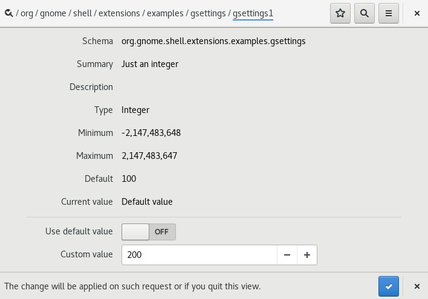

Settings
========

gsettings1
**********

.. note::

   To use settings for your application we first have to define it in an XML schema file

.. literalinclude:: src/gsettings1-example/gsettings-example.gschema.xml
   :caption: /usr/share/glib-2.0/schemas/gsettings-example.gschema.xml

.. warning::

   Just creating the XML schema is not enough. GNOME looks for settings in a compiled file called **/usr/share/glib-2.0/schemas/gschemas.compiled**
   so we have to trigger a re-compile of all the XML files

.. code-block:: shell

   glib-compile-schemas /usr/share/glib-2.0/schemas/

.. note::

   The actual code

.. literalinclude:: src/gsettings1-example/extension.js
   :language: javascript
   :caption: ~/.local/share/gnome-shell/extensions/gsettings1-example/extension.js

.. literalinclude:: src/gsettings1-example/metadata.json
   :language: javascript
   :caption: ~/.local/share/gnome-shell/extensions/gsettings1-example/metadata.json

.. note::

   After you restarted GNOME Shell and enabled the extension it should log the current value

.. code-block:: shell
   :caption: /var/log/kern.log

   JS LOG: ===== gsettings1 Example =====
   JS LOG: 100

.. note::

   We can manually change the setting with **dconf-editor**.
   Changing the value actually notifies the extension
   which shows up in the logfile again.

.. code-block:: shell

   dconf-editor

